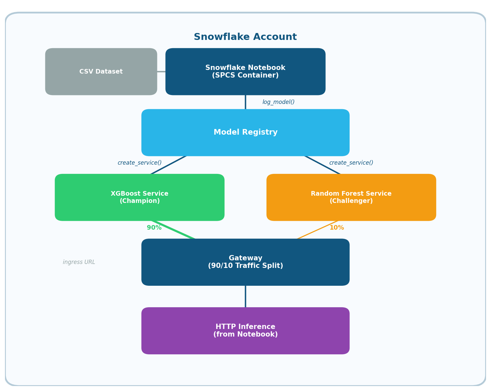
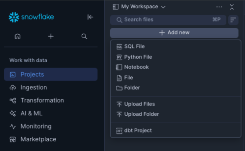

author: Eric Gudgion
id: operationalize-ml-models
language: en
summary: Train, deploy, and operationalize ML models on Snowflake with canary deployments, gateways, and autocaptured inference metrics
categories: snowflake-site:taxonomy/solution-center/certification/quickstart
environments: web
status: Published
feedback link: https://github.com/Snowflake-Labs/sfguides/issues

# Operationalize ML Models
<!-- ------------------------ -->
## Overview

### What You'll Build

An end-to-end machine learning pipeline that trains two fraud detection models, registers them in the Snowflake Model Registry, deploys them as live SPCS (Snowpark Container Services) endpoints, and routes inference traffic between them using a gateway with configurable traffic splitting.

This pattern is commonly known as **shadow or canary deployment** — you run a proven "champion" model alongside an experimental "challenger" model, gradually shifting traffic to validate the challenger in production before a full rollover.

One benefit is that this provides a stable endpoint for inference that does not change across service restarts.

This quickstart uses a Notebook to achieve but in the repo is an optional StreamLit application that includes model monitoring and comparisons using another new feature, AutoCapture. 

### What You'll Learn

- Loading and engineering features from a fraud transaction dataset
- Training an XGBoost (champion) and Random Forest (challenger) classifier
- Registering models in the Snowflake Model Registry with metrics and metadata
- Deploying model services on Snowpark Container Services (SPCS)
- Creating a gateway with weighted traffic splitting between two model endpoints
- Sending live HTTP inference requests to the gateway from inside a Snowflake Notebook
- Cleaning up all resources when finished

### What You'll Need

- A Snowflake account with Snowpark Container Services enabled
- A role with the privileges listed in the [Prerequisites](#prerequisites) section
- The `notebook/fraud_demo_dataset.csv` file and the notebook `notebook/Demo_Train_Deploy.ipynb` uploaded to the notebook workspace
- A Snowflake Notebook running in an SPCS environment (not a local Jupyter session)

### Architecture

Architecture Diagram



## Prerequisites

This notebook runs **inside a Snowflake Notebook on SPCS**. The SPCS environment provides a container token for OAuth-based authentication, which the notebook uses to establish a Snowpark session automatically.

Your role needs the following grants. An `ACCOUNTADMIN` can run these (but the notebook will check you have them):

```sql
GRANT CREATE MODEL ON SCHEMA <database>.<schema> TO ROLE <your_role>;
GRANT CREATE SERVICE ON SCHEMA <database>.<schema> TO ROLE <your_role>;
GRANT CREATE GATEWAY ON SCHEMA <database>.<schema> TO ROLE <your_role>;
GRANT BIND SERVICE ENDPOINT ON ACCOUNT TO ROLE <your_role>;
GRANT USAGE ON COMPUTE POOL <compute_pool_name> TO ROLE <your_role>;
```

You also need the `fraud_demo_dataset.csv` file added to your notebook's workspace files. This CSV contains synthetic transaction data with columns for transaction details, customer information, and a binary `is_fraud` label.

## Uploading Files to Workspace

Snowflake Workspaces offer a unified environment for file management, SQL execution, and running Notebooks.

To begin, access Snowsight and navigate to Projects and Workspaces. You will need to upload both the `.ipynb` and `.csv` files required for this demonstration by selecting "Upload Files" and choosing the files from your local directory.

After the files are successfully uploaded, open the `.ipynb` file. The Notebook will launch, allowing you to make any necessary environment-specific modifications.

Workspace File Upload


## Step 1: Configuration (Cell 1)

The first code cell defines every user-configurable variable used throughout the pipeline. All values are collected here so you can adapt the notebook to your environment by editing a single cell.

```python
# Snowflake connection settings
SF_WAREHOUSE = "<warehouse>"
SF_DATABASE = "<database>"
SF_SCHEMA = "<schema>"
SF_ROLE = "<role>"

# Path to the fraud dataset CSV inside the SPCS container
LOCAL_DATA_PATH = "fraud_demo_dataset.csv"

# Model registry identifiers
CHAMPION_MODEL_NAME = "FRAUD_DETECTION_XGBOOST"
CHALLENGER_MODEL_NAME = "FRAUD_DETECTION_RF"
MODEL_VERSION = "V1"

# SPCS service names for deployed model endpoints
CHAMPION_SERVICE_NAME = "FRAUD_XGBOOST_SERVICE"
CHALLENGER_SERVICE_NAME = "FRAUD_RF_SERVICE"

# Compute pool and scaling
COMPUTE_POOL = "SYSTEM_COMPUTE_POOL_CPU"
MAX_INSTANCES = 1
INGRESS_ENABLED = True

# Gateway traffic splitting
GATEWAY_NAME = "FRAUD_MODEL_GATEWAY"
CHAMPION_WEIGHT = 90
CHALLENGER_WEIGHT = 10

# Training parameters
SEED = 42
TEST_SIZE = 0.2

# Inference testing
NUM_INFERENCE_REQUESTS = 100
INFERENCE_METHOD = "predict"

# Cleanup flags
DROP_COMPUTE_POOL = False
RUN_CLEANUP = False
```

**Key points:**.   

- `COMPUTE_POOL`: The name of an existing compute pool. `SYSTEM_COMPUTE_POOL_CPU` is a shared system pool; set a custom name and the notebook will create one for you.  
- `CHAMPION_WEIGHT` / `CHALLENGER_WEIGHT`: Control what percentage of inference traffic goes to each model. Adjust these and re-run the gateway cell to change the split live.  
- `RUN_CLEANUP`: A safety flag — set to `True` only when you are ready to tear down all resources.

<!-- ------------------------ -->
## Step 2: Import Packages (Cell 3)

This cell imports all required Python libraries. These are pre-installed in the SPCS notebook environment:

```python
import os
import numpy as np
import pandas as pd
import xgboost as xgb
from sklearn.ensemble import RandomForestClassifier
from sklearn.model_selection import train_test_split
from sklearn.preprocessing import LabelEncoder
from sklearn.metrics import (
    classification_report,
    confusion_matrix,
    roc_auc_score,
    average_precision_score,
)
from snowflake.snowpark import Session
from snowflake.ml.registry import Registry
from snowflake.ml.model import task
```

**Libraries used:**  


| Library                   | Purpose                                                             |
| ------------------------- | ------------------------------------------------------------------- |
| `xgboost`                 | Champion model — gradient-boosted tree classifier                   |
| `scikit-learn`            | Challenger model (Random Forest), preprocessing, evaluation metrics |
| `pandas` / `numpy`        | Data manipulation and numerical operations                          |
| `snowflake.snowpark`      | Snowflake session management                                        |
| `snowflake.ml.registry`   | Model Registry for versioned model storage                          |
| `snowflake.ml.model.task` | Task type annotation for registered models                          |


<!-- ------------------------ -->
## Step 3: Connect to Snowflake (Cell 5)

Inside an SPCS container, a session token is available at `/snowflake/session/token`. The notebook reads this token and uses it with OAuth-based authentication to create a Snowpark `Session`:

```python
def get_login_token():
    with open('/snowflake/session/token', 'r') as f:
        return f.read()

connection_params = {
    "account": os.getenv('SNOWFLAKE_ACCOUNT'),
    "host": os.getenv('SNOWFLAKE_HOST'),
    "authenticator": "oauth",
    "token": get_login_token(),
    "database": SF_DATABASE,
    "schema": SF_SCHEMA,
}
```

The `SNOWFLAKE_ACCOUNT` and `SNOWFLAKE_HOST` environment variables are automatically set by the SPCS runtime. No passwords or key files are needed.

The cell prints the active role, warehouse, database, and schema to confirm the connection is correct.

<!-- ------------------------ -->
## Step 4: Verify Privileges (Cell 7)

Before proceeding, this cell checks that your role has all the grants needed for the pipeline:

- `CREATE MODEL` on the target schema
- `CREATE SERVICE` on the target schema
- `CREATE GATEWAY` on the target schema
- `BIND SERVICE ENDPOINT` on the account
- `USAGE` on the compute pool

It runs `SHOW GRANTS TO ROLE` and compares the results against the required list. If any are missing, it prints the exact `GRANT` statements an `ACCOUNTADMIN` needs to run. This saves you from encountering permission errors deep into the pipeline.

<!-- ------------------------ -->
## Step 5: Load the Dataset (Cell 9)

The raw fraud dataset is loaded from the CSV file in the notebook workspace:

```python
df = pd.read_csv(LOCAL_DATA_PATH)
```

The dataset contains synthetic e-commerce transactions with fields like `transaction_amount`, `customer_email_domain`, `customer_ip_country`, `payment_method`, `card_type`, `device_type`, `browser`, and a binary `is_fraud` label indicating whether the transaction was fraudulent.

The cell prints the row count and the fraud rate (percentage of fraudulent transactions), which is typically low — reflecting the class imbalance common in real-world fraud detection.

<!-- ------------------------ -->
## Step 6: Feature Engineering (Cell 10)

This quickstart is not focused on the feature engineering and training aspects, so a real fraud model would have more complex feartures.

Raw transaction data is transformed into model-ready features:

**Columns dropped:** `transaction_id`, `timestamp`, `customer_id`, `currency`, `item_name` — these are identifiers or free-text fields that don't generalize as features.

**New features created:**


| Feature               | Logic                                                                                                         |
| --------------------- | ------------------------------------------------------------------------------------------------------------- |
| `is_disposable_email` | 1 if the customer's email domain is in a known disposable email list (e.g., `tempmail.com`, `mailinator.com`) |
| `is_high_risk_ip`     | 1 if the customer's IP country is in a high-risk set (`NG`, `RO`, `PH`, `UA`, `ID`)                           |
| `amount_per_item`     | `transaction_amount / item_quantity` — unusually high values may signal fraud                                 |


**Categorical encoding:** Nine categorical columns (`customer_email_domain`, `customer_ip_country`, `billing_country`, `shipping_country`, `payment_method`, `card_type`, `item_category`, `device_type`, `browser`) are label-encoded to integers using scikit-learn's `LabelEncoder`.

The target variable `is_fraud` is separated into `y`, and the remaining columns become the feature matrix `X` (18 features total).

<!-- ------------------------ -->
## Step 7: Train the Champion Model — XGBoost (Cell 12)

The data is split into training (80%) and test (20%) sets with stratification to preserve the fraud/legit ratio:

```python
X_train, X_test, y_train, y_test = train_test_split(
    X, y, test_size=TEST_SIZE, random_state=SEED, stratify=y,
)
```

The class imbalance is handled with `scale_pos_weight` — the ratio of legitimate to fraudulent transactions — which tells XGBoost to penalize misclassifying the minority (fraud) class more heavily:

```python
xgb_model = xgb.XGBClassifier(
    n_estimators=300,
    max_depth=6,
    learning_rate=0.1,
    scale_pos_weight=scale_pos_weight,
    eval_metric="aucpr",
    random_state=SEED,
)
```

After training, the model is evaluated on the test set and key metrics (accuracy, fraud precision/recall/F1, ROC-AUC, PR-AUC) are captured in a dictionary for later registration.

<!-- ------------------------ -->
## Step 8: Train the Challenger Model — Random Forest (Cell 13)

The challenger uses a Random Forest with `class_weight="balanced"` to handle class imbalance (an alternative to explicit weight scaling):

```python
rf_model = RandomForestClassifier(
    n_estimators=500,
    max_depth=12,
    min_samples_leaf=5,
    class_weight="balanced",
    random_state=SEED,
    n_jobs=-1,
)
```

The same evaluation metrics are captured for the challenger model.

<!-- ------------------------ -->
## Step 9: Compare Models (Cell 14)

A side-by-side comparison table is printed showing both models across all metrics:

```
============================================================
HEAD-TO-HEAD COMPARISON
============================================================
Metric                          XGBoost   Random Forest    Winner
------------------------------------------------------------
  Fraud Precision                0.9234        0.8901    XGBoost
  Fraud Recall                   0.8567        0.8789         RF
  ...
```

This helps you decide whether the champion designation is justified. In a real scenario, you might swap which model is the champion based on these results.

<!-- ------------------------ -->
## Step 10: Register Models in the Model Registry (Cell 16)

Both trained models are registered in the Snowflake Model Registry using `reg.log_model()`:

```python
reg = Registry(session=session, database_name=SF_DATABASE, schema_name=SF_SCHEMA)

xgb_mv = reg.log_model(
    xgb_model,
    model_name=CHAMPION_MODEL_NAME,
    version_name=MODEL_VERSION,
    sample_input_data=sample_input,
    conda_dependencies=["xgboost"],
    metrics=xgb_metrics,
    task=task.Task.TABULAR_BINARY_CLASSIFICATION,
    comment="Champion model - XGBoost fraud classifier (300 trees, depth 6)",

)
```

**Key parameters:**

- `sample_input_data`: A sample of the test set, used by the registry to infer the model's input schema (column names and types).
- `conda_dependencies`: The packages the model needs at inference time. XGBoost requires `["xgboost"]`; Random Forest requires `["scikit-learn"]`.
- `metrics`: The evaluation metrics dictionary — stored as metadata alongside the model version.
- `task`: Annotates the model as a binary classification task, enabling the registry to validate inputs/outputs.

If the model already exists (e.g., from a previous run), the cell catches the "already exists" error and fetches the existing reference instead of failing.

<!-- ------------------------ -->
## Step 11: Verify or Create a Compute Pool (Cell 18)

Before deploying services, this cell checks whether the configured compute pool exists:

```python
pools = [row["name"] for row in session.sql("SHOW COMPUTE POOLS").collect()]
```

- If `COMPUTE_POOL` starts with `SYSTEM_COMPUTE_POOL`, it's a system-managed pool and is used as-is.
- Otherwise, if the pool doesn't exist, it's created with `CPU_X64_XS` instance family (1 node).
- In this demo, we build two models, setting the number of nodes to 3 (notebook, 2 x models) willl reduce the time taken at this step.

<!-- ------------------------ -->
## Step 12: Deploy Model Services (Cell 19)

Both models are deployed as SPCS services **in parallel** using `ThreadPoolExecutor, in the demo we use this as the build and deploy step can take 30 minutes`:

```python
def deploy_service(model_fqn, version, service_name):
    mv = reg.get_model(model_fqn).version(version)
    mv.create_service(
        service_name=service_name,
        service_compute_pool=COMPUTE_POOL,
        ingress_enabled=INGRESS_ENABLED,
        max_instances=MAX_INSTANCES,
        autocapture=True,
    )
```

**Key parameters:**

- `ingress_enabled=True`: Makes the service accessible via an HTTPS endpoint (required for HTTP inference).
- `autocapture=True`: Automatically records the model input and outputs. This is one of the new Snowflake features!
- `max_instances=1`: Limits each service to one container instance.

Parallel deployment cuts the total wait time roughly in half compared to sequential deployment. After both complete, the cell describes each service to confirm its status.

<!-- ------------------------ -->
## Step 13: Create the Gateway with Traffic Splitting (Cell 21)

A gateway is created that routes incoming inference requests between the two model services:

```python
spec = f"""
spec:
  type: traffic_split
  split_type: custom
  targets:
    - type: endpoint
      value: {service1_endpoint}
      weight: {CHAMPION_WEIGHT}
    - type: endpoint
      value: {service2_endpoint}
      weight: {CHALLENGER_WEIGHT}
"""

session.sql(f"CREATE OR REPLACE GATEWAY {gateway_fqn} FROM SPECIFICATION $${spec}$$").collect()
```

With the default configuration, 90% of requests go to the XGBoost champion and 10% go to the Random Forest challenger. This is a **canary deployment** pattern — the challenger receives a small slice of live traffic so you can monitor its performance before promoting it.

The gateway exposes a single HTTPS ingress URL. Callers don't need to know which model they're hitting — the gateway handles routing transparently.

<!-- ------------------------ -->
## Step 14: Wait for Gateway Provisioning (Cell 22)

SPCS gateways take a moment to provision and receive an ingress URL. This cell polls `DESC GATEWAY` every 10 seconds until the `ingress_url` field is populated (up to a 5-minute timeout):

```python
while elapsed < MAX_WAIT_SECONDS:
    result = session.sql(f"DESC GATEWAY {gateway_fqn}").collect()
    ingress_url = row_dict.get('ingress_url', '')
    if ingress_url:
        print(f"Ingress URL: https://{ingress_url}")
        break
    time.sleep(POLL_INTERVAL)
```

Once the URL appears, you can proceed to inference testing.

<!-- ------------------------ -->
## Step 15: Update Traffic Split (Cell 23) — Optional

If you want to change the traffic distribution without recreating the gateway, modify `CHAMPION_WEIGHT` and `CHALLENGER_WEIGHT` in the configuration cell and run this cell:

```python
session.sql(f"ALTER GATEWAY {gateway_fqn} FROM SPECIFICATION $${updated_spec}$$").collect()
```

Common scenarios:

- **100/0**: Send all traffic to the champion (disable challenger).
- **50/50**: Equal split for A/B testing.
- **0/100**: Promote the challenger to receive all traffic.

<!-- ------------------------ -->
## Step 16: Inference Testing (Cell 25)

This is the most complex cell. It sends live HTTP requests to the gateway endpoint from inside the SPCS notebook and compares predictions against known labels.

### Authentication

SPCS notebooks use OAuth-based sessions, but SPCS ingress endpoints require a different token format. The cell works around this by:

1. **Creating a temporary Programmatic Access Token (PAT):**
  ```python
   session.sql(
       f"ALTER USER ADD PAT {PAT_NAME} DAYS_TO_EXPIRY = 1 "
       f"MINS_TO_BYPASS_NETWORK_POLICY_REQUIREMENT = 60 "
       f"COMMENT = 'Temp token for notebook inference testing'"
   ).collect()
  ```
   The PAT expires in 1 day. `MINS_TO_BYPASS_NETWORK_POLICY_REQUIREMENT = 60` allows the PAT to be used without a network policy for 60 minutes.
2. **Opening a PAT-authenticated connector session:**
  ```python
   pat_conn = snowflake.connector.connect(
       account=sf_account,
       user=sf_user,
       authenticator="programmatic_access_token",
       token=pat_secret,
       ...
   )
  ```
3. **Extracting an ingress-compatible session token:**
  ```python
   token_data = pat_conn._rest._token_request("ISSUE")
   ingress_token = token_data["data"]["sessionToken"]
  ```
   This token is used in the `Authorization` header as `Snowflake Token="<token>"`.

### Request Loop

The cell samples `NUM_INFERENCE_REQUESTS` rows from the test set and sends each one to the gateway as an HTTP POST:

```python
payload = {"dataframe_split": json.loads(X_sample.iloc[[i]].to_json(orient="split"))}
resp = requests.post(gateway_url, headers=headers, json=payload, timeout=30)
```

The `dataframe_split` format preserves column names and data types, matching the schema the model expects. Each request includes retry logic (up to 4 attempts with 10-second backoff) for transient failures.

### Response Parsing

The model service returns predictions in this format:

```json
{"data": [[0, {"output_feature_0": 0}]]}
```

The cell extracts the prediction, compares it against the actual label, and prints a per-request summary:

```
  [1/100]  Status: 200  |    145ms  |  Actual: LEGIT  |  Predicted: LEGIT
  [2/100]  Status: 200  |     89ms  |  Actual: FRAUD  |  Predicted: FRAUD
```

### Cleanup

After all requests complete, the PAT connection is closed and the temporary PAT is removed:

```python
pat_conn.close()
session.sql(f"ALTER USER REMOVE PAT {PAT_NAME}").collect()
```

A summary is printed showing success rate, prediction accuracy, and average response time.

```
======================================================================
SUMMARY: 500/500 requests returned HTTP 200
         493/500 predictions matched actual label
         Avg response time: 75ms  |  Total: 37289ms
         Gateway: https://<instance>-<orgname>-<account>.snowflakecomputing.app/predict
======================================================================
```

<!-- ------------------------ -->
## Step 17: Model Serving Metrics (Cell 29)

Now that you have sent inference requests through the gateway, you can query the **autocaptured inference tables** to see server-side metrics for each model. Because you deployed the services with `autocapture=True` in Step 12, Snowflake automatically logs every request and response — no additional instrumentation required.

This cell runs a `UNION ALL` query across both models' inference tables to produce a side-by-side comparison:

```python
metrics_sql = f"""
SELECT
    '{CHAMPION_MODEL_NAME}' AS MODEL_NAME,
    'Champion' as "A/B Test",
    COUNT(*) AS TOTAL_REQUESTS,
    SUM(CASE WHEN record_attributes:"snow.model_serving.response.code"::VARCHAR LIKE '2%' THEN 1 ELSE 0 END) AS SUCCESS_COUNT,
FROM TABLE(INFERENCE_TABLE('{SF_DATABASE}.{SF_SCHEMA}.{CHAMPION_MODEL_NAME}'))
WHERE record_attributes:"snow.model_serving.request.timestamp" >= DATEADD(minute, -60, CURRENT_TIMESTAMP())

UNION ALL

SELECT
    '{CHALLENGER_MODEL_NAME}' AS MODEL_NAME,
    'Challenger' as "A/B Test",
    COUNT(*) AS TOTAL_REQUESTS,
    SUM(CASE WHEN record_attributes:"snow.model_serving.response.code"::VARCHAR LIKE '2%' THEN 1 ELSE 0 END) AS SUCCESS_COUNT
FROM TABLE(INFERENCE_TABLE('{SF_DATABASE}.{SF_SCHEMA}.{CHALLENGER_MODEL_NAME}'))
WHERE record_attributes:"snow.model_serving.request.timestamp" >= DATEADD(minute, -60, CURRENT_TIMESTAMP())
"""

metrics_df = session.sql(metrics_sql).to_pandas()
```

Here is an example output after several executions of the inference cell, with different traffic splits:

```
Model Serving Metrics (last 60 minutes)
======================================================================
             MODEL_NAME   A/B Test  TOTAL_REQUESTS  SUCCESS_COUNT
FRAUD_DETECTION_XGBOOST   Champion             435            435
     FRAUD_DETECTION_RF Challenger             765            765
======================================================================
```

**What the columns tell you:**


| Column           | Meaning                                             |
| ---------------- | --------------------------------------------------- |
| `MODEL_NAME`     | Which model handled the requests                    |
| `A/B Test`       | Model designation                                   |
| `TOTAL_REQUESTS` | Number of inference requests in the last 60 minutes |
| `SUCCESS_COUNT`  | Requests that returned an HTTP 2xx response         |


The `INFERENCE_TABLE()` function is a Snowflake table function that reads from the autocapture logs. The `record_attributes` column contains structured metadata about each request, including timestamps and response codes. Because this data lives in Snowflake, you can join it with other tables, build dashboards, or set up alerts — just like any other SQL-queryable data.

**Tip:** If you see zero rows, make sure you ran the Inference Testing cell within the last 60 minutes. You can widen the time window by changing `-60` to a larger value.

<!-- ------------------------ -->
## Step 18: Experiment — Things to Try (Cells 30–31)

With both models deployed and the gateway serving traffic, the notebook provides a dedicated experimentation cell. This is where the real value of canary deployments becomes clear — you can make live changes and immediately observe the impact.

### Experiment Ideas

1. **Change the traffic split** — Shift more traffic to the challenger to see how it performs under load. Try 50/50 for an even A/B test, or 0/100 to fully promote the challenger.
2. **Register and deploy a V2 model** — Go back to the training cells, adjust the hyperparameters (e.g., increase `n_estimators` or `max_depth`), register the new model as `MODEL_VERSION = "V2"`, deploy it as a new service, and add it to the gateway.
3. **Drop a model from the gateway** — Remove one of the targets from the gateway spec to serve all traffic from a single model. This simulates a production rollover.
4. **Increase request volume** — Set `NUM_INFERENCE_REQUESTS` to 500 or 1000 for more statistically meaningful results. More requests give you better latency percentiles and a clearer picture of the traffic split.
5. **Compare metrics over time** — Re-run the metrics cell after each experiment to watch how request counts, success rates, and latency change.

### Using the Experimentation Cell

The cell at the end of this section lets you update the gateway and inference configuration in one place:

```python
NEW_CHALLENGER_WEIGHT = 50
NEW_NUM_INFERENCE_REQUESTS = 500
```

When you run it, it:

1. Alters the gateway to the new traffic split using `ALTER GATEWAY ... FROM SPECIFICATION`
2. Updates the global `CHAMPION_WEIGHT`, `CHALLENGER_WEIGHT`, and `NUM_INFERENCE_REQUESTS` variables so the next run of the Inference Testing cell uses the new values

After running this cell, go back and re-run the **Inference Testing** cell (Step 16) followed by the **Model Serving Metrics** cell (Step 17) to see the impact of your changes.

<!-- ------------------------ -->
## Step 19: Cleanup (Cell 33)

The final cell tears down all resources created by the notebook. It is **guarded by the** `RUN_CLEANUP` **flag** — nothing happens unless you explicitly set `RUN_CLEANUP = True` in the configuration cell.

```python
if not RUN_CLEANUP:
    print("Cleanup skipped. Set RUN_CLEANUP = True to enable.")
else:
    # Drop services, gateway, and models
    ...
```

Resources removed (in order):

1. Champion service (`DROP SERVICE`)
2. Challenger service (`DROP SERVICE`)
3. Gateway (`DROP GATEWAY`)
4. Champion model (`DROP MODEL`)
5. Challenger model (`DROP MODEL`)
6. Compute pool (only if `DROP_COMPUTE_POOL = True` and it's not a system pool)

Each step uses `IF EXISTS` so partial cleanup from a previous run won't cause errors.

<!-- ------------------------ -->
## Key Concepts

### Snowflake Model Registry

The [Model Registry](https://docs.snowflake.com/en/developer-guide/snowpark-ml/model-registry/overview) is a versioned catalog for ML models inside Snowflake. When you call `reg.log_model()`, the model object (e.g., a trained XGBoost classifier) is serialized and stored as a named, versioned artifact. You can attach metadata like evaluation metrics, task type, and free-text comments.

Registered models can be deployed as SPCS services with a single method call (`model_version.create_service()`), which builds a container image, starts the service, and exposes an inference endpoint — all without writing Dockerfiles or managing images.

### Snowpark Container Services (SPCS)

[SPCS](https://docs.snowflake.com/en/developer-guide/snowpark-container-services/overview) runs OCI-compatible containers inside Snowflake's infrastructure. Each model service runs in its own container on a compute pool, with automatic scaling, health monitoring, and secure networking.

Services can expose HTTP endpoints via ingress, making them accessible for real-time inference from any client that can authenticate with a Snowflake session token.

### Gateways and Traffic Splitting

A [gateway](https://docs.snowflake.com/en/developer-guide/snowpark-container-services/working-with-gateways) is an SPCS routing layer that sits in front of one or more service endpoints. By configuring `traffic_split` with custom weights, you can:

- Send a small percentage of traffic to a new model to validate it before full rollout.
- Split traffic evenly between two models to compare real-world performance.
- Update a model without the external endpoint url changing

The gateway presents a single URL — clients don't need to know about the underlying services.

### Programmatic Access Tokens (PATs)

[PATs](https://docs.snowflake.com/en/user-guide/programmatic-access-tokens) are short-lived tokens that can authenticate to Snowflake without interactive login. In this notebook, a PAT is used to obtain a session token compatible with SPCS ingress authentication. The PAT is created with a 1-day expiry and is deleted immediately after use.

<!-- ------------------------ -->
## Troubleshooting

### "Network policy is required" when creating the PAT connection

The PAT is created with `MINS_TO_BYPASS_NETWORK_POLICY_REQUIREMENT = 60`, which provides a 60-minute window for PAT authentication without a network policy. If this window has expired, re-run the inference cell to create a fresh PAT.

### Gateway shows no ingress URL

The gateway may still be provisioning. Re-run the polling cell (Cell 22). Provisioning typically takes 1-3 minutes.

### HTTP 500 from the gateway

This usually means the service containers are still starting up. Wait a minute and retry. You can check service status with:

```sql
DESCRIBE SERVICE <database>.<schema>.<service_name>;
```

### "Already exists" errors during model registration

This is handled automatically — the cell catches the error and fetches the existing model version. If you need a clean re-registration, either increment `MODEL_VERSION` in the configuration cell or run the cleanup cell first.

### Privilege errors

Run the privilege verification cell (Cell 7) to see exactly which grants are missing, along with the SQL statements to fix them.

<!-- ------------------------ -->
## Conclusion And Resources

Congratulations! You have successfully built an end-to-end ML operationalization pipeline on Snowflake — from training and registering models, to deploying them as live services, routing traffic with a gateway, and monitoring inference metrics with autocapture.

### What You Learned
- How to train and evaluate competing ML models (XGBoost vs Random Forest)
- How to register models in the Snowflake Model Registry with metrics and metadata
- How to deploy model services on Snowpark Container Services (SPCS)
- How to create a gateway with weighted traffic splitting for canary deployments
- How to authenticate and send live HTTP inference requests from an SPCS notebook
- How to query autocaptured inference metrics using `INFERENCE_TABLE()`
- How to experiment with traffic splits and observe the impact in real time

### Next Steps
- **Adjust the traffic split** to promote the challenger model (change weights to 0/100)
- **Add more models** by registering additional model versions and updating the gateway spec with more targets
- Use the **StreamLit application** that provides a UI-based approach to all these workflows
- **Automate retraining** by wrapping this pipeline in a Snowflake Task that runs on a schedule
- **Monitor model drift** by comparing prediction distributions over time using the metrics stored in the Model Registry
- **Connect external clients** to the gateway ingress URL using keypair authentication or PAT token exchange for production inference workloads

### Related Resources
- [Snowflake Model Registry Documentation](https://docs.snowflake.com/en/developer-guide/snowpark-ml/model-registry/overview)
- [Snowpark Container Services Overview](https://docs.snowflake.com/en/developer-guide/snowpark-container-services/overview)
- [Working with Gateways](https://docs.snowflake.com/en/developer-guide/snowpark-container-services/working-with-gateways)
- [Programmatic Access Tokens](https://docs.snowflake.com/en/user-guide/programmatic-access-tokens)

